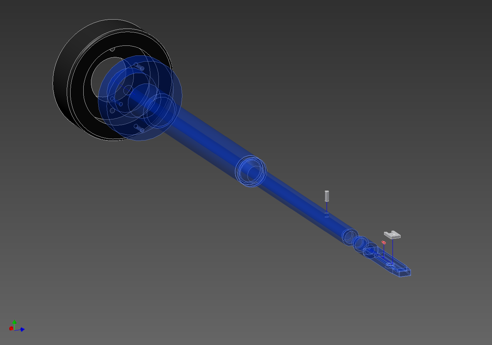

# TEM-holder

[construction instructions](PDFs/Halter.idw.pdf), [3D view](STLs/Halter_expl.stl)

Construction files of a holder for a high precision gas injection system inside a transmission electron microscope (TEM), part of my diploma thesis. For more info see: [diploma-thesis](https://github.com/romangrothausmann/diploma-thesis/).

